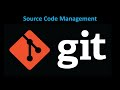

# Работа с Git

## 1. Проверка наличия установленного Git

В терминале выполнить команду `git version`

Если Git установлен, появится сообщение с информацией о версии программы. Иначе будет сообщение об ошибке.

## 2. Установка Git
Загружаем последнюю версию Git c https://git-scm.com/downloads

## 3. Настройка Git
При первом использовании Git необходимо представиться. Для этого нужно ввести в терминале две команды:
 ```
 git cionfig --global user.name "Ваше имя"
 git cionfig --global user.email "email@example.com"
```
 
 ## 4. Инициализация репозитория

 Для того чтобы в открытой папке задействовать функции репозитория в терминале вводим команду

 ```
 git init
 ```
## 5. Проверка на текущие изменения

Для того чтобы проверить добавлены ли изменения к отслеживанию после последнего сохранения данных в терминале вводим команду

```
git status
```
Если не добавлены, то название файла отображается __красным__, если добавлены то __зеленым__.

## 6. Добавление изменений к отслеживанию

Для добавления фйла к отслеживанию, а так же для добавления (подготовки) к следующей фиксации изменений (коммиту) используется команда

```
git add .\name_file
```
Для вывода имени файла достаточно ввести начало имени файла и нажать клавишу Tab.

## 7. Сохранение измений в файле (присвоение версии)

Для того чтобы сохранить изменения в файле (присвоить версию для последнего состояния файла) в терминале вводим команду  

```
git commit -m "comment"
```
где "coment" - описание последних действий в произвольной форме

## 8. Совмещение git add и git commit

Для одновременного добавления к следующему коммиту и выполнения коммита используется команда

```
git commit -am "coment"
```
Данная команда может использоваться не во всех случаях, а например при внесении измениний в один файл репозитория.

## 9. Просмотр изменений

Для вывода изменений в файле по сравнению с последним коммитом в терминале вводим команду
```
git diff
```
## 10. Просмотр истории коммитов

Для вывода на экран всех коммитов в терминале вводим команду 

```
git log
```
Для вывода истории коммитов в сокращенной форме используем команду

```
git log --oneline
```

## 11. Перемещение между сохранениями (версиями)

Для того чтобы перейти к любой предыдущей версии необходимо ввести команду 

```
git chechout 2cd8144 
```
где **2cd8144** пример ввода тега нужной версии, которую можно найти после вывода журнала командой __git log__
. При этом можно ввести от четырех символов и больше.
Для продолжения работы необходимо вернуться в актуальное состояние (последний коммит).

## 12. Игнорирование файлов

В репозитории могут использоваться файлы, индексировать которые нет необходимости, например файлы с изображениями. Такие файлы игнорируются коммитами. Для обозначения файлов как игнорируемые создается в корне репозитория файл с названием **.gitignore**
и в данный файл заносятся названия файлов? которые требуется игнорировать или указывается расширение файлов, если все файлы данного расширения требуется игнорировать, например:
```
image.jpg
.jpg
```

## 13. Создание веток в Git
Ветка в Git - простой перемещаемый указатель на один из коммитов, обычно последний в цепочке коммитов.
По умолчанию имя основной ветки в Git - master.
Создать ветку можно командой:
```
git branch <имя новой ветки>
```

В результате создается новый указатель на текущий коммит

Чтобы переключиться на нужную ветку используется команда `git checkout <имя новой ветки>`

Чтобы при создании ветки сразу на неё переключиться используется команда `git checkout -b <имя новой ветки>`

Список веток в репозитории можно посмотреть с помощью команды `git branch`

## 14. Слияние веток и разрешение конфликтов

Для слияния выбранной ветки с текущей нужно выполнить команду `git merge <название выбранной ветки>`

Здесь напишем текст для создания конфликта. И еще немного.

Если была изменена одна и та же часть файла в обеих ветках, то межет возникнуть конфликт, который потребует участие пользователя.

Конфликт не случился не понятно почему.
Если была изменена одна и та же часть файлав обеих ветках, то межет возникнуть конфликт, который потребует участие пользователя.
Программа пердложит несколько решений из которых пользователь должен выбрать:
* Оставить информацию исходного файла
* Записать информацию файла из "сливаемой" ветки
* Объединить информацию обоих файлов
* Сравнить изменения

## 15. Удаление веток

Для того чтобы удалить ненужную ветку необходимо не находиться на ней и ввести команду
```
git branch -d <name_branch>
```

## 16. Работа с удаленными репозиториями

### 16.1 Основные команды

Для работы с удаленными репозиториями необходимо зарегестрироваться на сервисе (например GitHub).
* команда `git clone /ссылка/` создает локальную копию удаленного репозитория
* команда `git pull` скачивает изменения с удаленного репозитория в локальный, автоматически делая merge 
* команда `git push` отправляет локальный репозиторий на внешний. 

*Необходима авторизация!*

### 16.2 Добавление своих изменений в чужой репозиторий (pull request)


* В своём аккаунте на GitHub создать копию репозитория /имя чужого репозитория/ с помощью кнопки **"Fork"**.

* Клонировать копию репозитория на локальный компьютер.

* Создать новую ветку.

* Добавить свои изменения в новую ветку.

* Зафиксировать изменения (коммиты).

* Отправить изменения на GitHub.

* На сайте GitHub выполнить **Pull request**.

### 16.3 Еще некоторые команды для работы с удаленным репозиторием

`git remote -v` показывает, какие удаленные репозитории привязаны к локальному
`git remote add /название удаленного репозитория/ /ссылка на удаленный репозиторий/` подключает удаленный репозиторий к локальному по указанным именем